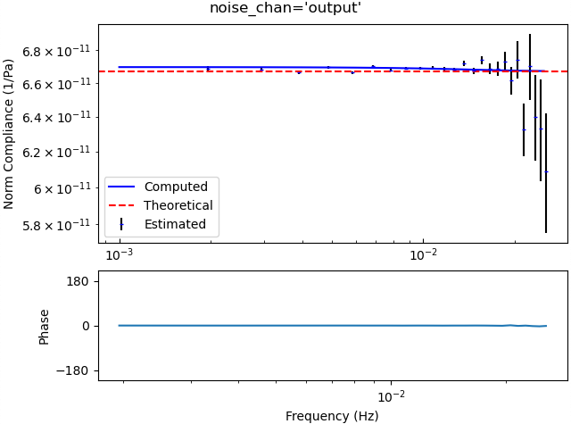
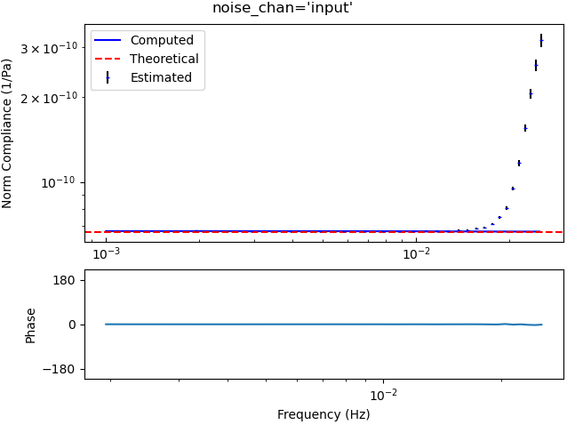
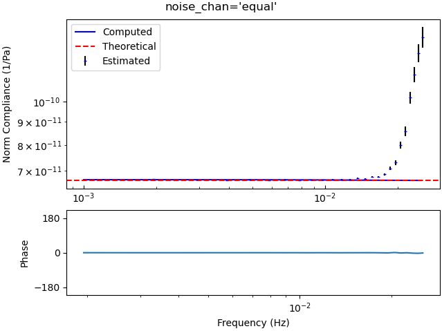
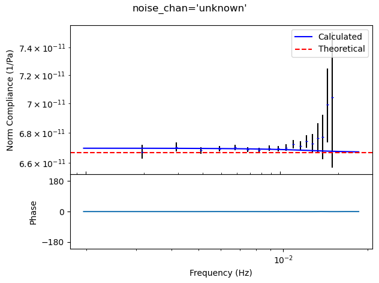

.. _tiskitpy.Compliance_example:

===================================
Compliance Calculation example code
===================================

.. code-block:: python

    """
    Calculate compliance for a half-space model, and compare it to
    the theoretical value and the one calculated from derived data
    """
    from obspy import UTCDateTime
    from obspy.core.stream import Trace
    import numpy as np
    import matplotlib.pyplot as plt

    from tiskitpy import (SpectralDensity, SeafloorSynthetic, ResponseFunctions,
                          Compliance)

    # PARAMETERS
    rho, vp, vs = 2500, 4000, 2000  # kg/m^3, m/s, m/s
    no_noise = True

    # Almost perfectly leveled Z to get measureable compliance without cleaning
    kwargs = {'Z_offset_angles': (0.01, 0),
              'earth_model': [[1000, rho, vp, vs],
                              [1000, rho, vp, vs],
                              [1000, rho, vp, vs]]}
    if no_noise is True:
        kwargs['Z_offset_angles'] = (0.00, 0)
        kwargs['noise_pressure'] = ([[0.001, -150], [1, -150]], True)
        kwargs['noise_seismo'] =   ([[0.001, -250], [1, -250]], True)

    # Create noise model
    noise_model = SeafloorSynthetic(**kwargs)

    # Create synthetic data from the noise model
    n_days = 10
    s_rate = 1
    sta_code = 'SYNTH'
    synth_start_time = '2024-01-01T00'
    resp_trace = Trace(np.ones(86400*n_days*s_rate),
                       header={'sampling_rate': s_rate,
                               'starttime': UTCDateTime(synth_start_time),
                               'channel': 'LHZ'})

    # Specify sensitivities that keep the compliance values in the passband                           
    s_sensitivity = 1e13  # Below 1e10 and above 1e15, compliance is too low
    p_sensitivity = 1e5  # Below 1e2 and above 1e7, compliance is too high

    data_synth, sources, inv_synth = noise_model.streams(
        resp_trace, s_response=s_sensitivity, p_response=p_sensitivity,
        station=sta_code, forceInt32=True)

    # If I use the standard prol4pi (or kaiser4pi or dpss4) taper, high frequency
    # values are too high (because pressure drops faster than motion?)
    sd_synth = SpectralDensity.from_stream(data_synth, inv=inv_synth, windowtype='dpss1')

    # Theoretical compliance assuming c << vp, vs
    ncompl_theoretical = - vp**2 / (2 * rho * vs**2 * (vp**2 - vs**2))

    # Compare theoretical, calculated and "measured" compliance for different
    # assumptions of which channel the noise is on
    for noise_chan in ("output", "input", "equal", "unknown"):
        # Calculate normalized compliance from the data
        rfs = ResponseFunctions(sd_synth,  '*LDG', ['*LHZ'],
                                noise_channel=noise_chan)
        ncompl_est = Compliance.from_response_functions(rfs, noise_model.water_depth)
        # Calculate normalized compliance directly from the model
        ncompl_computed = Compliance.from_seafloor_synthetic(noise_model)

        # Plot comparison of theoretical, model-computed and "data-estimated" compliances
        axa, axp = ncompl_est.plot(show=False)
        axa.plot(ncompl_computed.freqs, np.abs(ncompl_computed.values), c='b', label='Computed')
        axa.axhline(np.abs(ncompl_theoretical), ls='--', c='r', label='Theoretical')
        axa.legend()
        plt.suptitle(f'{noise_chan=}')
        plt.show()
        plt.close()

   

   

   

   
