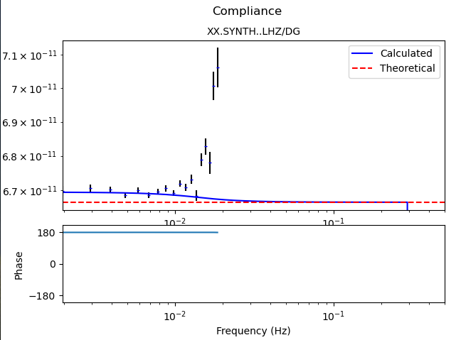

.. _tiskitpy.Compliance_example:

===================================
Compliance Calculation example code
===================================

.. code-block:: python

    """
    Calculate compliance for a half-space model, and compare it to
    the theoretical value and the one calculated from derived data
    """
    from obspy import UTCDateTime
    from obspy.core.stream import Trace
    import numpy as np
    import matplotlib.pyplot as plt

    from tiskitpy import SpectralDensity, ComplianceNoise, ResponseFunctions

    # PARAMETERS
    rho = 2500  # kg/m^3
    vp  = 4000  # m/s
    vs  = 2000  # m/s_rate
    # Use very low noise levels (essentially no pressure or seismo gauge noise)
    kwargs = {'noise_pressure': ([[0.001, -50], [1, -50]], True),
              'noise_seismo': ([[0.001, -230], [1, -230]], True),
              'noise_tilt_max': ([[f, np.power(10., -17) * np.power(f, -1.51)]
                                  for f in np.power(10, np.arange(-3, 0.1, .25))],
                                 False),
              'earth_model': [[1000, rho, vp, vs],
                              [1000, rho, vp, vs]]}

    max_compl_freq = 0.02

    # Create noise model
    noise_model = ComplianceNoise(**kwargs)

    # Create synthetic data from the noise model
    n_days = 10
    s_rate = 1
    sta_code = 'SYNTH'
    synth_start_time = '2024-01-01T00'
    resp_trace = Trace(np.ones(86400*n_days*s_rate),
                       header={'sampling_rate': s_rate,
                               'starttime': UTCDateTime(synth_start_time),
                               'channel': 'LHZ'})
    s_sensitivity = 1e11  # A lower sensitivity makes compliance too low (compliance signal truncated?)
    data_synth, sources, inv_synth = noise_model.streams(
        resp_trace, s_sensitivity=s_sensitivity, station=sta_code, forceInt32=True)
    sd_synth = SpectralDensity.from_stream(data_synth, inv=inv_synth)

    # Calculate normalized compliance from the data
    ncompl_est = ResponseFunctions(sd_synth,  '*LDG', ['*LHZ'],
                                   max_freq=max_compl_freq, noise_chan='equal')
    ncompl_est.to_norm_compliance(noise_model.water_depth)

    # Calculate normalized compliance directly from the model
    ncompl_real = noise_model.norm_compliance(ncompl_est.freqs)

    # Theoretical compliance assuming c << vp, vs
    ncompl_theoretical = - vp**2 / (2 * rho * vs**2 * (vp**2 - vs**2))

    # Compare theoretical, model-calculated and "data-calculated" compliances
    axes = ncompl_est.plot(show=False)
    ax = axes[0, 0][0]
    ax.plot(ncompl_est.freqs, np.abs(ncompl_real), c='b', label='Calculated')
    ax.axhline(np.abs(ncompl_theoretical), ls='--', c='r', label='Theoretical')
    ax.legend()
    print(f'{ncompl_est.value("*LHZ")[1]=}, {ncompl_real[0]=}, {ncompl_theoretical=}, ')
    plt.show()

   
