.. _tiskitpy.PeriodicTransient_example:

==============================
PeriodicTransient example code
==============================

First, read some data and create a PeriodicTransient objet
----------------------------------------------------------
.. code-block:: python

    from tiskitpy.rptransient import PeriodicTransient
    from obspy.core.stream import read

    # Transient parameters
    transient_starttime = '2009-01-23T09:00:00'
    transient_clips = (-1000, 1000)
    transient_period = 3600
    dp = 1

    stream = read('data/LSVSB.Z.sample.mseed', 'MSEED')
    trace_train = stream.select(channel="*MHZ")[0].copy()

    # PERIODIC TRANSIENT
    pt = PeriodicTransient("hourly_glitch",
                           transient_period,
                           dp=dp, clips=transient_clips,
                           transient_starttime=transient_starttime)

The Transient parameters are simply guesses, although we know that the
period is about one hour

Next, run ``calc_timing()``
---------------------------------------------

.. code-block:: python

    print('\n\n***RUNNING CALC_TIMING***')
    pt.calc_timing(trace_train)

The program starts by plotting stacked waveforms, spaced by ``transient_period``
and with clip levels given by ``transient clips``

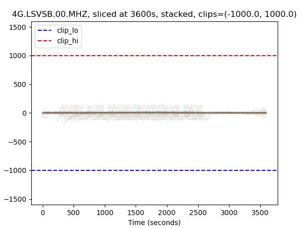
   
It writes out the clip levels and asks the user to enter new ones.  Here, the
user entered ``-200, 200``:

.. code-block:: console

    Enter clip levels containing all transients (RETURN for current value) (-1000.0, 1000.0): -200, 200

The result is better, but still a bit too much:

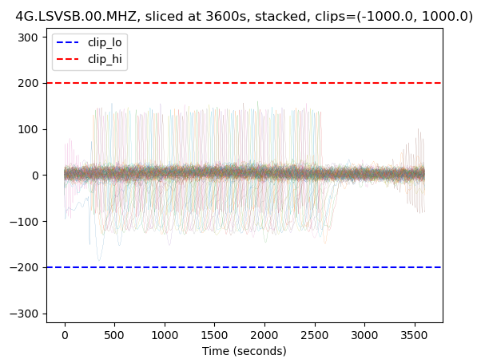
   
The user now enters ``-150, 150``:

.. code-block:: console

    Enter clip levels containing all transients (RETURN for current value) (-1000.0, 1000.0): -150, 150

The result is pretty good now:

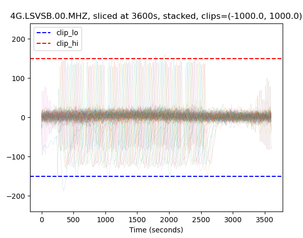
   

The user now hits the return key, which accepts the current values and
moves on to estimating the periodic transient period:

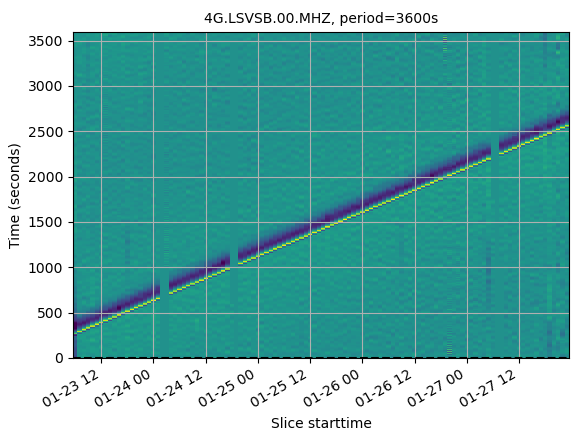
   
The slope is positive, so the user enters a larger value: 3610

.. code-block:: console

    If the slope is positive, INCREASE the period
    Enter new test period  (RETURN uses current value) [3600]: 3610

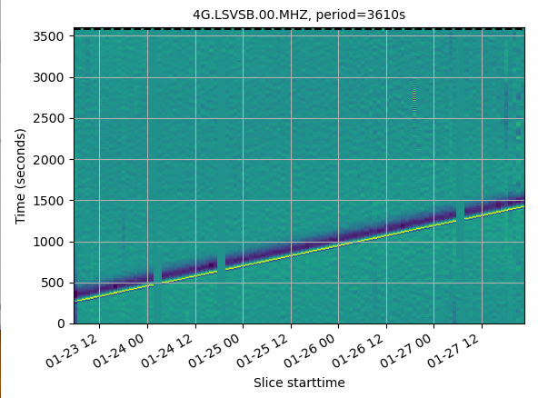
   
The slope is still positive, so the user enters a larger value:

.. code-block:: console

    Enter new test period  (RETURN uses current value) [3610]: 3620

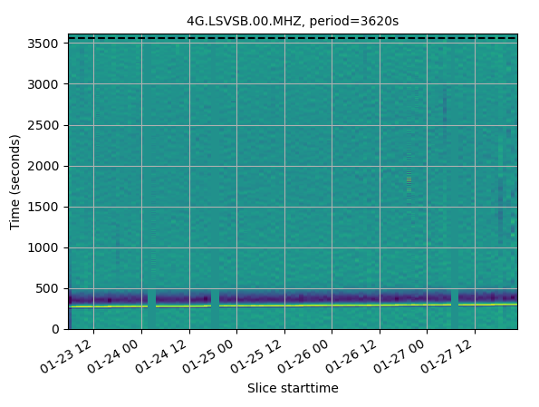
   
The slope is pretty flat, maybe a little bit positive, so the user enters a slightly larger value:

.. code-block:: console

    Enter new test period  (RETURN uses current value) [3620]: 3621
    

   
The slope is now negative, go back to the previous value, then accept it by
hitting return at the next question

.. code-block:: console

    Enter new test period  (RETURN uses current value) [3621]: 3620
    Enter new test period  (RETURN uses current value) [3621]:
    
The code moves on to the transient_starttime:

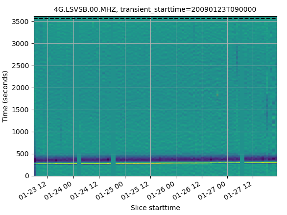
    
The dashed line is a little to far "below" the start of the transient (actually,
it's above, but as the vertical axis wraps, one can consider it to be
a few hundred seconds below)

.. code-block:: console

    If the dotted line is beneath the transient, enter a POSTIVE offset
    transient_starttime = 2009-01-23T09:00:00.000000Z
    Enter offset seconds  (RETURN uses current value) [0]: 200

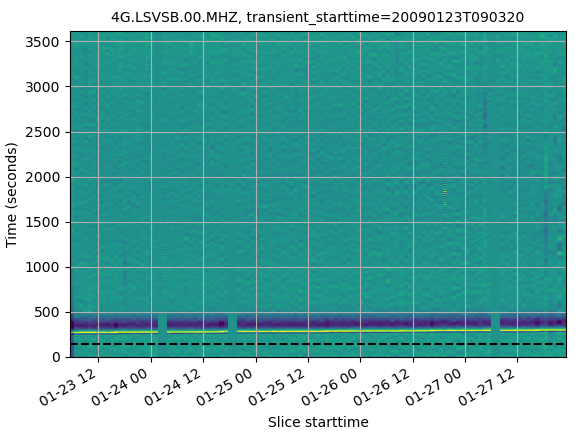

The result is better, the dashed line is below the transients, but not too far.
Accept the latest time by hitting return

.. code-block:: console
    transient_starttime = 2009-01-23T09:03:20.000000Z
    Enter offset seconds  (RETURN uses current value) [0]: 
    transient starttime set to 2009-01-23T09:03:20.000000Z

One could now put the found parameters at the top of the file:

.. code-block:: python

    # Transient parameters
    transient_starttime = '2009-01-23T09:03:200'
    transient_clips = (-150, 150)
    transient_period = 3620
    dp = 1

(the ``dp`` value controls how far to either side of the transient period
that ``calc_transient()`` will consider when trying to find the "exact" period)

Next, run ``calc_transient()``
---------------------------------------------

Using the newfound transient value (which are also stored in the ``pt`` object),
we can run ``calc_transient()``:

.. code-block:: python

    pt.calc_transient(trace_train, plots=True)

The first plot shows which traces were selected, which ones were rejected because
of a known earthquake, and which ones were rejected because their variance was
anomalously:

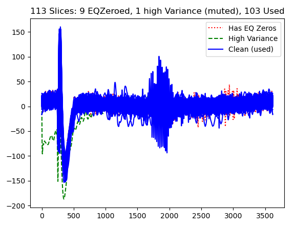

You have to close it manually, after which the code calculates the "dirac comb"
it will multipy each transient by, testing periods from
``transient_starttime - dp`` to ``transient_starttime + dp` for the best
overlap of transients.
Once it has finished, it shows the "ideal" dirac comb, plus the one it will use
to calculate the transient (which lacks "teeth" around known earthquakes
and high variance windows)

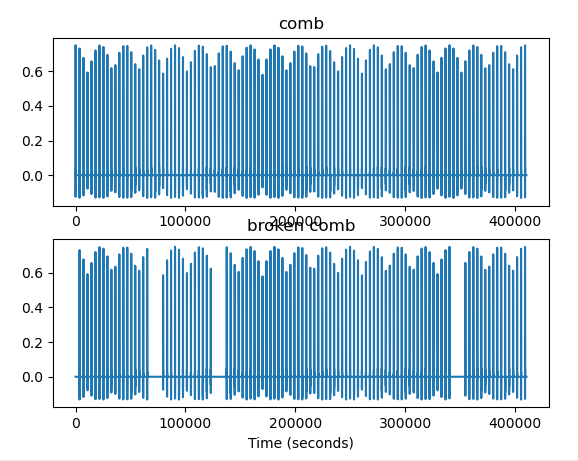

When you close this window, the code averages all aligned transients (using the
"broken comb" and plots the result, next to a sample data window)

.. code-block:: console

    Running comb_calc("hourly_glitch": 3620.00s+-1.0, clips=(-150, 150), training and matching freq bounds=(True, 0.05), transient_starttime=2009-01-23T09:03:20.000000Z
    	Rejecting high-variance slices (>2.295e+06+3*4.763e+05)...1 of 113 rejected
    	Running comb_stack(period=3619.0s)
    	Running _comb_remove_all
    	Running comb_stack(period=3620.0s)
    	Running _comb_remove_all
    	Running comb_stack(period=3621.0s)
    	Running _comb_remove_all
    	best period found=3620.13
    	Running comb_stack(period=3620.1276643498136s)

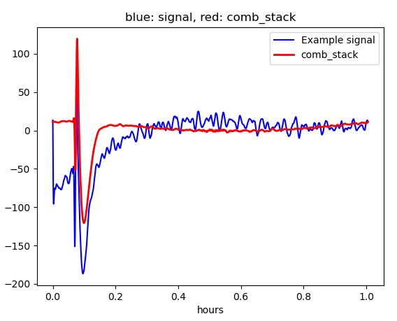

Finally, the code plots the best-fit transient, by itself

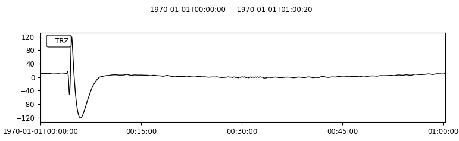

Lastly, run ``remove_transient()``
---------------------------------------------

.. code-block:: python

    stream_before = stream.copy()  # This is simply for comparison later
    trace = stream.select(channel="*MHZ")[0]
    trace_after = pt.remove_transient(trace, plots=True)

The program plots the original data, the cleaned data (channel code="CLN")
and the synthetic transient that was removed from the data (channel code='SYN')

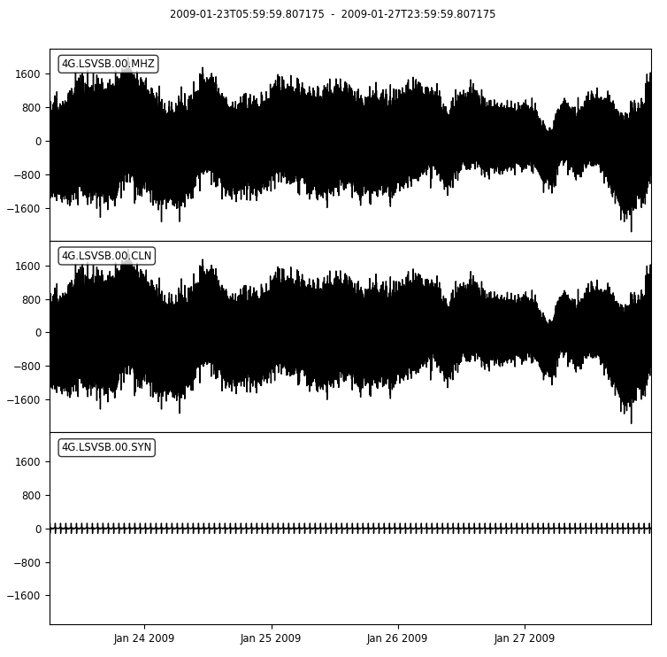

We don't see any difference!  That is because the data are dominated by microseisms
which are much stronger that the infragravity waves and therefore not strongly affected
by the glitch.  ``calc_timing()`` and ``calc_transients()`` filter out, by
default, the microseisms (parameters ``freq_HP`` and ``freq_LP`` )

If we want to see the effect of our work, we need to filter in a similar fashion.

First, we import the corrected trace into ``stream``:

.. code-block:: python

    # Replace the Z component trace with the one with the removed transient
    for i, t in enumerate(stream):
        if t.stats.channel == 'MHZ':
            print('replacing channel')
            stream[i] = trace_after
            break

Then we put the before and after traces in a stream, change the before stream's
location code to 99 (so that we can tell which is which in the plot), lowpass filter
the data at the same frequency as ``calc_timing`` and ``calc_transient``.

.. code-block:: python

    # Compare filtered stream before and after
    trace_before = stream_before.select(channel='MHZ').copy()
    trace_after = stream.select(channel='MHZ').copy()
    trace_before[0].stats.location='99'
    stream_compare = trace_before + trace_after
    stream_compare.filter("lowpass", freq=pt.freq_LP)
    stream_compare.plot()

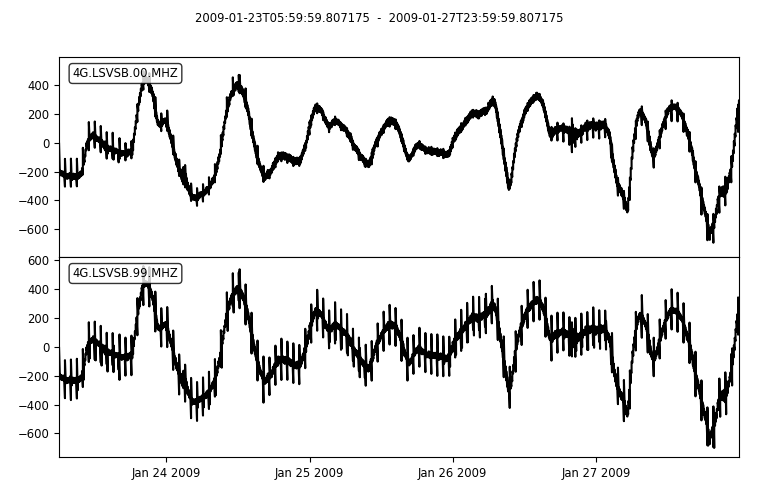

The new waveform lacks most of the hourly transients that plagued the original
data.  But there are still a few sections with the transients.  Room for
improvement...
