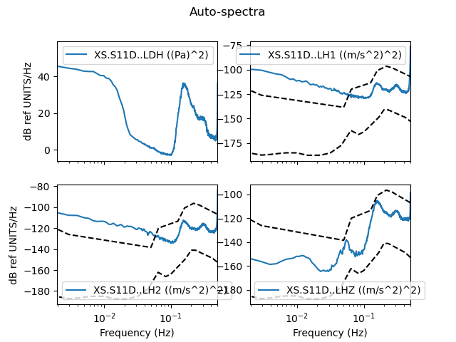
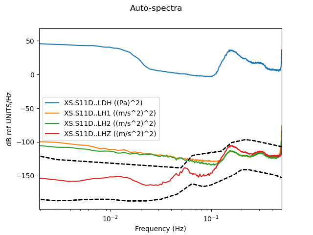
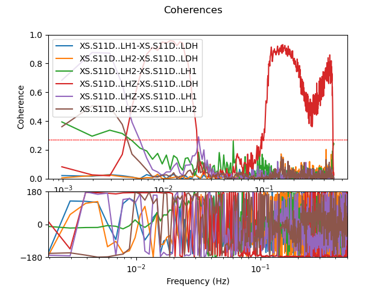
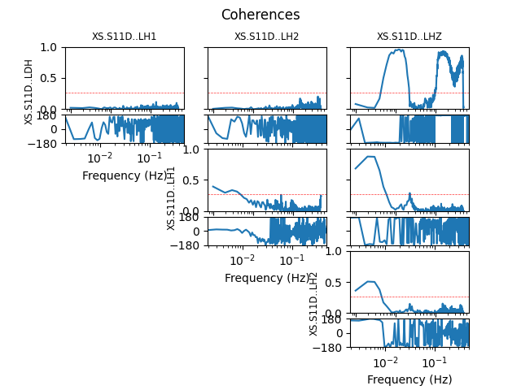

.. _tiskitpy.SpectralDensity_example:

==============================
SpectralDensity example code
==============================

from ``tiskitpy/_examples/1_SpectralDensity.py``

.. code-block:: python

    from obspy.core.stream import read
    from obspy.core.inventory import read_inventory
    from tiskitpy import SpectralDensity

    # read data and inventory
    stream = read('data/XS.S11D.LH.2016.12.11.mseed', 'MSEED')
    inv = read_inventory('data/XS.S11_decimated.station.xml', 'STATIONXML')

    # Calculate Spectral Density
    sd = SpectralDensity.from_stream(stream, inv=inv)

.. code-block:: none

    INFO:root:z_threshold=3 rejected 3 of 84 windows (4%)

.. code-block:: python

    print(sd)

.. code-block:: none

    SpectralDensity object:
        channel_names=['XS.S11D..LDH', 'XS.S11D..LH1', 'XS.S11D..LH2', 'XS.S11D..LHZ']
        channel_units=['Pa', 'm/s^2', 'm/s^2', 'm/s^2']
        512 frequencies, from 0.000977 to 0.5Hz
        n_windows=81
        window_type=prol1pi

.. code-block:: python

    # plot results
    base = "1_SpectralDensity"
    sd.plot(outfile=f'{base}_plot.png')

   
.. code-block:: python

    sd.plot(overlay=True, outfile=f'{base}_plot_overlay.png')

   
.. code-block:: python

    sd.plot_coherences()

.. image:: images/1_SpectralDensity_coher.png
   :width: 564
   
.. code-block:: python

    sd.plot_coherences(display="full", outfile=f'{base}_coher_full.png')

   
.. code-block:: python

    sd.plot_coherences(display="overlay", outfile=f'{base}_coher_overlay.png')

.. code-block:: python

    sd.plot_coherences(display="sparse", outfile=f'{base}_coher_sparse.png')

.. code-block:: python

    sd.plot_coherences(display="minimal", outfile=f'{base}_coher_minimal.png')

