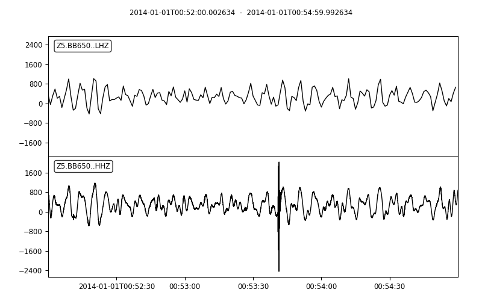

.. _tiskitpy.Decimator_example:

==============================
Decimator example code
==============================

Decimating data and updating the metadata

This example uses data and inventory from a FDSN data server

.. code-block:: python

    from obspy.clients.fdsn import Client
    from obspy.core import UTCDateTime

    from tiskitpy import Decimator

    # Specify FDSN server dataset
    client_address = 'IRIS'
    net = 'Z5'
    sta = 'BB650'  # Trillium T240. 100 sps
    loc = '*'
    cha = 'HH*,HDH'
    starttime = UTCDateTime('2014-01-01T00:52')
    endtime = UTCDateTime('2014-01-01T00:55')

    # Read data and inventory
    client = Client(client_address)
    print('reading data from FDSN server...')
    stream = client.get_waveforms(network=net, station=sta, channel=cha,
                                  location=loc, starttime=starttime,
                                  endtime=endtime)
    print('reading inventory from FDSN server...')
    inv = client.get_stations(starttime=starttime, endtime=endtime,
                              network=net, station=sta, channel='*', location='*',
                              level='response')

.. code-block:: none

    reading data from FDSN server...
    reading inventory from FDSN server...

.. code-block:: python

     print(inv)

.. code-block:: none

    Inventory created at 2023-07-15T20:55:39.100100Z
        Created by: IRIS WEB SERVICE: fdsnws-station | version: 1.1.52
                http://service.iris.edu/fdsnws/station/1/query?starttime=2014-01-01...
        Sending institution: IRIS-DMC (IRIS-DMC)
        Contains:
            Networks (1):
                Z5
            Stations (1):
                Z5.BB650 (SIO OBS ID BB650)
            Channels (8):
                Z5.BB650..HDH, Z5.BB650..HHZ, Z5.BB650..HH1, Z5.BB650..HH2, 
                Z5.BB650..HXZ, Z5.BB650..HX1, Z5.BB650..HX2, Z5.BB650..HXH

.. code-block:: python

    # DECIMATE DATA by 100 and update inventory
    decim = Decimator([5, 5, 4])
    stream_decim = decim.decimate(stream)
    
.. code-block:: none

    [INFO] Decimating data from 100 to 1 Hz (100x)... 
    [INFO] Took 0.0 seconds
    [INFO] Decimating data from 100 to 1 Hz (100x)... 
    [INFO] Took 0.0 seconds
    [INFO] Decimating data from 100 to 1 Hz (100x)... 
    [INFO] Took 0.0 seconds
    [INFO] Decimating data from 100 to 1 Hz (100x)... 
    [INFO] Took 0.0 seconds
    [INFO] New data has [180, 180, 180, 180] samples
    
.. code-block:: python

    inv_decim = decim.update_inventory(inv, stream)

.. code-block:: none

    [INFO] channel modified from Z5.BB650..HDH (100.0 sps)
     WARNING: FIR normalized: sum[coef]=9.767192E-01;     
    [INFO] to Z5.BB650..LDH (1 sps)
    [INFO] channel modified from Z5.BB650..HH1 (100.0 sps)
     WARNING: FIR normalized: sum[coef]=9.767192E-01;     
    [INFO] to Z5.BB650..LH1 (1 sps)
    [INFO] channel modified from Z5.BB650..HH2 (100.0 sps)
     WARNING: FIR normalized: sum[coef]=9.767192E-01;     
    [INFO] to Z5.BB650..LH2 (1 sps)
    [INFO] channel modified from Z5.BB650..HHZ (100.0 sps)
     WARNING: FIR normalized: sum[coef]=9.767192E-01;     
    [INFO] to Z5.BB650..LHZ (1 sps)
    
.. code-block:: python

    print(inv_decim)

.. code-block:: none

    Inventory created at 2023-07-15T20:55:39.100100Z
        Created by: IRIS WEB SERVICE: fdsnws-station | version: 1.1.52
                http://service.iris.edu/fdsnws/station/1/query?starttime=2014-01-01...
        Sending institution: IRIS-DMC (IRIS-DMC)
        Contains:
            Networks (1):
                Z5
            Stations (1):
                Z5.BB650 (SIO OBS ID BB650)
            Channels (12):
                Z5.BB650..HDH, Z5.BB650..HHZ, Z5.BB650..HH1, Z5.BB650..HH2, 
                Z5.BB650..HXZ, Z5.BB650..HX1, Z5.BB650..HX2, Z5.BB650..HXH, 
                Z5.BB650..LDH, Z5.BB650..LHZ, Z5.BB650..LH1, Z5.BB650..LH2

.. code-block:: python

    compare_z = stream.select(channel='*Z') + stream_decim.select(channel='*Z')
    print(compare_z)

.. code-block:: none

    2 Trace(s) in Stream:
    Z5.BB650..HHZ | 2014-01-01T00:52:00.002634Z - 2014-01-01T00:54:59.992634Z | 100.0 Hz, 18000 samples
    Z5.BB650..LHZ | 2014-01-01T00:52:00.002634Z - 2014-01-01T00:54:59.002634Z | 1.0 Hz, 180 samples

.. code-block:: python

    compare_z.plot()

