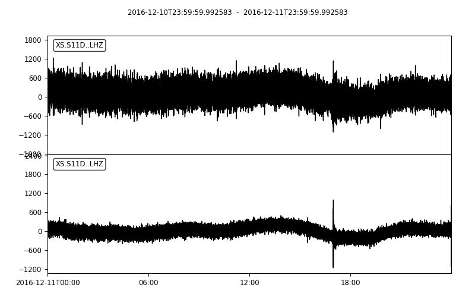
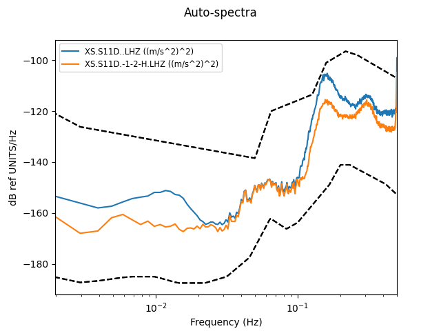

.. _tiskitpy.DataCleaner_example:

==============================
DataCleaner example code
==============================

.. code-block:: python

    from obspy.core.stream import read
    from obspy.core.inventory import read_inventory
    from tiskitpy import DataCleaner, SpectralDensity

    # Read data and inventory
    stream = read('data/XS.S11D.LH.2016.12.11.mseed', 'MSEED')
    inv = read_inventory('data/XS.S11_decimated.station.xml', 'STATIONXML')

    # Calculate a Datacleaner that will subtract `*1`, then `*2`, then `*H`
    dc = DataCleaner(stream, ['*1','*2','*H'])

.. code-block:: none

    [INFO] z_threshold=3, rejected 4% of windows (3/84)
    [INFO] z_threshold=3, rejected 4% of windows (3/84)
    [INFO] z_threshold=3, rejected 4% of windows (3/84)
    [INFO] z_threshold=3, rejected 4% of windows (3/84)

.. code-block:: python

    # Clean the data, then construct a stream with original and cleaned channels
    stream_cleaned = dc.clean_stream(stream)
    z_compare = stream.select(channel='*Z') + stream_cleaned.select(channel='*Z')

.. code-block:: none

    [INFO] Correcting traces in the frequency domain

.. code-block:: python

    # If you print and plot the stream "normally", can not see which is which
    print(z_compare)
    z_compare.plot()

.. code-block:: none

    2 Trace(s) in Stream:
    XS.S11D..LHZ | 2016-12-10T23:59:59.992583Z - 2016-12-11T23:59:59.992583Z | 1.0 Hz, 86401 samples
    XS.S11D..LHZ | 2016-12-10T23:59:59.992583Z - 2016-12-11T23:59:59.992583Z | 1.0 Hz, 86401 samples

.. code-block:: python

    # The CleanSequence stream_plot() and stream_print() methods add clean sequence
    # info to the seed_id before running the corresponding Stream functions
    CleanSequence.stream_print(z_compare)
    CleanSequence.stream_plot(z_compare)

.. code-block:: none

    2 Trace(s) in Stream:
    XS.S11D..LHZ       | 2016-12-10T23:59:59.992583Z - 2016-12-11T23:59:59.992583Z | 1.0 Hz, 86401 samples
    XS.S11D.-1-2-H.LHZ | 2016-12-10T23:59:59.992583Z - 2016-12-11T23:59:59.992583Z | 1.0 Hz, 86401 samples

.. code-block:: python

    # compare spectral densities
    # (tiskitpy plot() automatically include CleanSequence information)
    sd_compare = SpectralDensity.from_stream(z_compare, inv=inv)
    sd_compare.plot(overlay=True)

.. code-block:: none

    [INFO] z_threshold=3, rejected 5% of windows (4/84)

   
   
