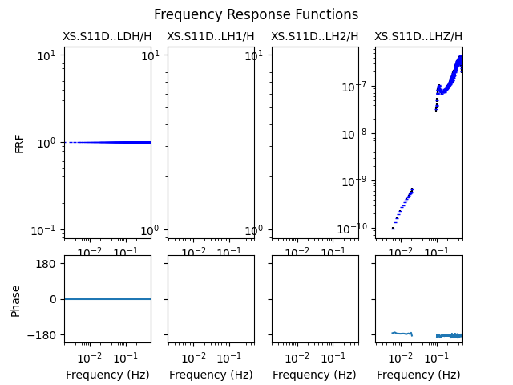

.. _tiskitpy.ResponseFunctions_example:

==============================
ResponseFunctions example code
==============================

.. code-block:: python

    from obspy.core.stream import read
    from obspy.core.inventory import read_inventory
    from tiskitpy import SpectralDensity, ResponseFunctions

    # Read in the data and metadata, and calculate a SpectralDensity
    stream = read('data/XS.S11D.LH.2016.12.11.mseed', 'MSEED')
    inv = read_inventory('data/XS.S11_decimated.station.xml', 'STATIONXML')
    sd = SpectralDensity.from_stream(stream, inv=inv)

    # Calculate the response functions with respect to the 'LDH' channel
    rfs = ResponseFunctions(sd, '*H')

    # Print the ResponseFunctions
    print(rfs)

.. code-block:: none

    ResponseFunctions object:
        input_channel='XS.S11D..LDH'
        output_channels=['XS.S11D..LDH', 'XS.S11D..LH1', 'XS.S11D..LH2', 'XS.S11D..LHZ']
        noise_channels=['output', 'output', 'output', 'output']
        n_windows=81

.. code-block:: python

    # Plot the ResponseFunctions
    rfs.plot()
    

The response_function only plots where there is significant coherence between the
two channels.
in this example, the pressure channel (LDH) only has a viable frequency response
function with:

- itself (duh, with a value of 1)
- the vertical channel, in the compliance and microseism bands

