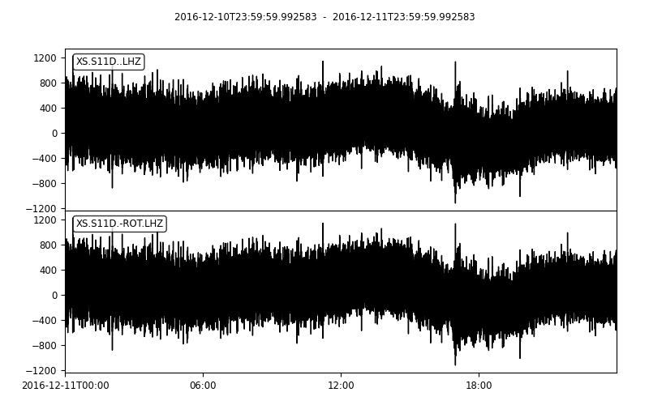

.. _tiskitpy.CleanRotator_example:

==============================
CleanRotator example code
==============================

.. code-block:: python

    from obspy.core.stream import read
    from obspy.core.inventory import read_inventory
    from tiskitpy import CleanRotator, SpectralDensity

    stream = read('data/XS.S11D.LH.2016.12.11.mseed', 'MSEED')
    inv = read_inventory('data/XS.S11_decimated.station.xml', 'STATIONXML')
    cr = CleanRotator(stream)

.. code-block:: console

    [INFO] fopt=510824.2528928297, iter=97, funcalls=185
    [INFO]     variance reduced from 2.07e+06 to 5.11e+05 (75.4% lower)
    [INFO]     Best angle= azimuth is (-0.09, 32.28)

.. code-block:: python

    stream_rotated = cr.apply(stream)
    z_compare = stream.select(channel='*Z') + stream_rotated.select(channel='*Z')
    z_compare.plot(outfile='5_CleanRotator_z_compare.png')
    print(z_compare)

.. code-block:: console

    2 Trace(s) in Stream:
    XS.S11D..LHZ     | 2016-12-10T23:59:59.992583Z - 2016-12-11T23:59:59.992583Z | 1.0 Hz, 86401 samples
    XS.S11D.-ROT.LHZ | 2016-12-10T23:59:59.992583Z - 2016-12-11T23:59:59.992583Z | 1.0 Hz, 86401 samples

.. code-block:: python

    z_compare.plot(outfile='5_CleanRotator_z_compare.png')

   
.. code-block:: python

    sd_compare = SpectralDensity.from_stream(z_compare, inv=inv)
    sd_compare.plot(overlay=True, outfile='5_CleanRotator_spect_compare.png')

.. code-block:: console

    [INFO] z_threshold=3, rejected 2% of windows (2/84)

.. image:: images/5_CleanRotator_spect_compare.png
   :width: 564
   
   
