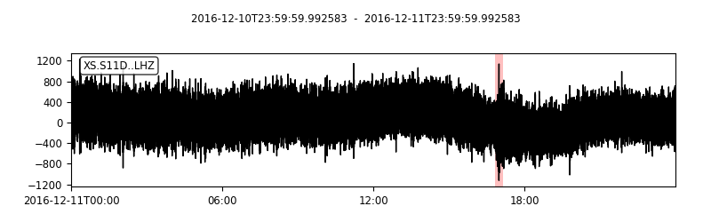
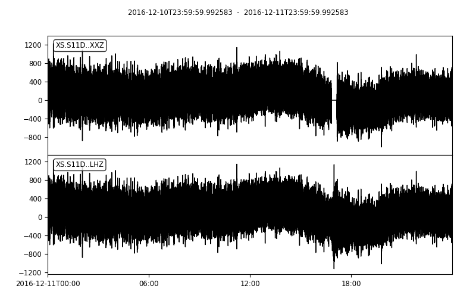
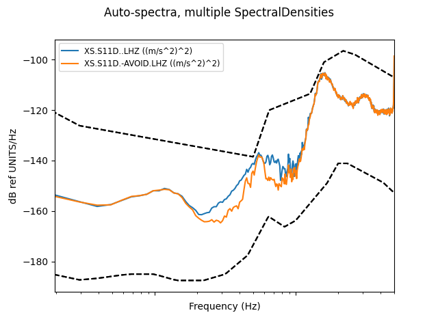

.. _tiskitpy.TimeSpans_example:

==============================
TimeSpans example code
==============================

.. code-block:: python

    from obspy.core.stream import read
    from obspy.core.inventory import read_inventory
    from tiskitpy import SpectralDensity, TimeSpans

    stream = read('data/XS.S11D.LH.2016.12.11.mseed', 'MSEED')
    inv = read_inventory('data/XS.S11_decimated.station.xml', 'STATIONXML')
    Z = stream.select(channel='*Z')

    # Select a time span to avoid
    ts = TimeSpans([['2016-12-11T16:50', '2016-12-11T17:10']])
    ts.plot(Z)

.. code-block:: python

    # Zero the data directly in the stream and plot the result
    Zs = Z.copy()
    Zs += ts.zero(Z)
    Zs.plot()

.. code-block:: python

    # Compare SpectralDensity objects calculated with and without this time span
    # (note: I cancel the z_threshold selection, which would probably have eliminated
    # the avoided section)
    kwargs={'inv': inv, 'z_threshold': None}
    sd =   SpectralDensity.from_stream(Z, **kwargs)
    sd_z = SpectralDensity.from_stream(Z, avoid_spans=ts, **kwargs)
    SpectralDensity.plots([sd, sd_z])

