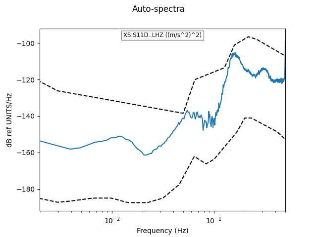
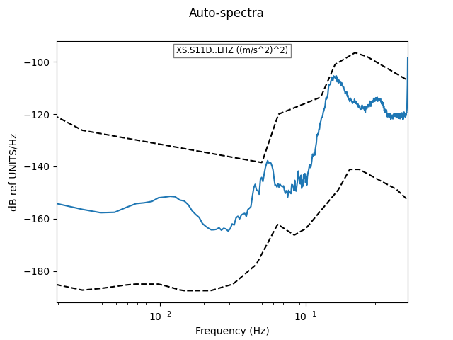

.. _tiskitpy.TimeSpans_example:

==============================
TimeSpans example code
==============================

.. code-block:: python

    from obspy.core.stream import read
    from obspy.core.inventory import read_inventory
    from tiskitpy import SpectralDensity, TimeSpans

    stream = read('data/XS.S11D.LH.2016.12.11.mseed', 'MSEED')
    inv = read_inventory('data/XS.S11_decimated.station.xml', 'STATIONXML')
    Z = stream.select(channel='*Z')
    ts = TimeSpans([['2016-12-11T16:50', '2016-12-11T17:10']])
    ts.plot(Z)

.. image:: images/6_TimeSpans_tsplot.png
   :width: 564

.. code-block:: python

    Zs = Z.copy()
    Zs += ts.zero(Z)
    Zs.plot()

.. image:: images/6_TimeSpans_zeroed.png
   :width: 564

.. code-block:: python

    # Use large z_threshold so that SpectralDensity doesn't automatically
    # reject high-spectral data
    kwargs={'inv': inv, 'z_threshold': 1000}
    sd =   SpectralDensity.from_stream(Z, **kwargs)
    sd_z = SpectralDensity.from_stream(Z, avoid_spans=ts, **kwargs)
    sd.plot()

.. code-block:: python

    sd_z.plot()

