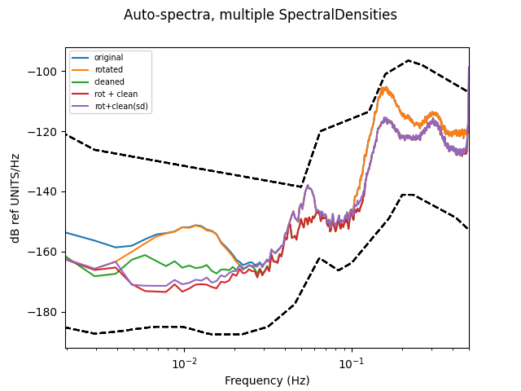

.. _tiskitpy.combined_example:

==============================
Combining classes
==============================

.. code-block:: python

    import fnmatch

    import numpy as np
    from obspy.core.stream import read
    from obspy.core.inventory import read_inventory
    from matplotlib import pyplot as plt

    from tiskitpy import CleanRotator, SpectralDensity, DataCleaner

    # Read data and metadata, and calculate a SpectralDensity
    stream = read('data/XS.S11D.LH.2016.12.11.mseed', 'MSEED')
    inv = read_inventory('data/XS.S11_decimated.station.xml', 'STATIONXML')
    sd_orig = SpectralDensity.from_stream(stream, inv=inv)
    
.. code-block:: console

    [INFO] z_threshold=3, rejected 4% of windows (3/84)

.. code-block:: python

    # USE SIMPLE ROTATION TO REDUCE VERTICAL CHANNEL NOISE
    rotator = CleanRotator(stream)
    rot_stream = rotator.apply(stream)
    sd_rot = SpectralDensity.from_stream(rot_stream, inv=inv)

.. code-block:: console

    [INFO] fopt=510824.2528928297, iter=97, funcalls=185
    [INFO]     variance reduced from 2.07e+06 to 5.11e+05 (75.4% lower)
    [INFO]     Best angle= azimuth is (-0.09, 32.28)

    [INFO] z_threshold=3, rejected 4% of windows (3/84)

.. code-block:: python

    # USE RESPONSE FUNCTION BASED DATA CLEANER TO REDUCE VERTICAL CHANNEL NOISE
    dc = DataCleaner(stream, ['*1', '*2', '*H'])
    dc_rot = DataCleaner(rot_stream, ['*1', '*2', '*H'])
    
.. code-block:: console

    [INFO] z_threshold=3, rejected 4% of windows (3/84)
    [INFO] z_threshold=3, rejected 4% of windows (3/84)
    [INFO] z_threshold=3, rejected 4% of windows (3/84)
    [INFO] z_threshold=3, rejected 4% of windows (3/84)

    [INFO] z_threshold=3, rejected 4% of windows (3/84)
    [INFO] z_threshold=3, rejected 4% of windows (3/84)
    [INFO] z_threshold=3, rejected 4% of windows (3/84)
    [INFO] z_threshold=3, rejected 4% of windows (3/84)

.. code-block:: python

    # Clean the stream and calculate its spectral density
    stream_dc = dc.clean_stream(stream)
    rot_stream_dc = dc_rot.clean_stream(rot_stream)
    sd_dc = SpectralDensity.from_stream(stream_dc, inv=inv)
    sd_rot_dc = SpectralDensity.from_stream(rot_stream_dc, inv=inv)
    
.. code-block:: console

    [INFO] Correcting traces in the frequency domain
    [INFO] Correcting traces in the frequency domain
    [INFO] z_threshold=3, rejected 6% of windows (5/84)
    [INFO] z_threshold=3, rejected 6% of windows (5/84)

.. code-block:: python

    # Directly calculate the spectral density from the DataCleaner
    sd_rot_sddc = dc_rot.clean_stream_to_sdf(rot_stream, inv=inv)

.. code-block:: console

    [INFO] z_threshold=3, rejected 4% of windows (3/84)

.. code-block:: python

    # PLOT THE RESULTS
    fig, ax = plt.subplots()
    for sd, label in zip(
            (sd_orig, sd_rot, sd_dc, sd_rot_dc, sd_rot_sddc),
            ('original', 'rotated', 'cleaned', 'rot + clean', 'rot+clean(sd)')):
        z_id = fnmatch.filter(sd.channel_names, '*.LHZ*')[0]
        ax.semilogx(sd.freqs, 10*np.log10(sd.autospect(z_id)), label=label)
    ax.set_xlabel('Frequency (Hz)')
    ax.set_ylabel('PSD (dB ref 1 (m/s^2)^2/Hz)')
    ax.legend()
    plt.show()

   