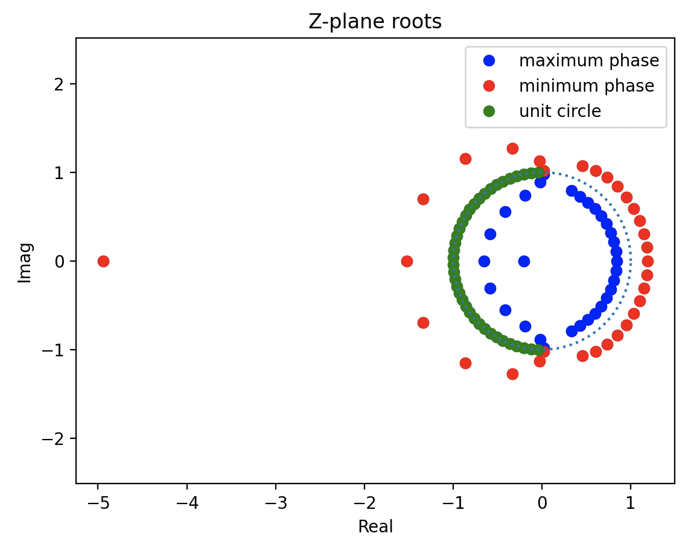
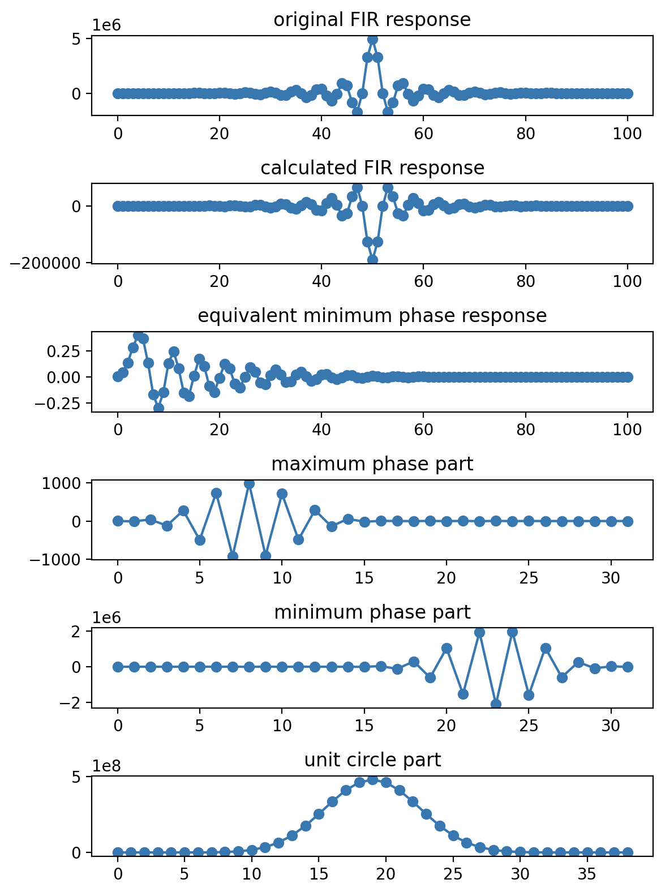
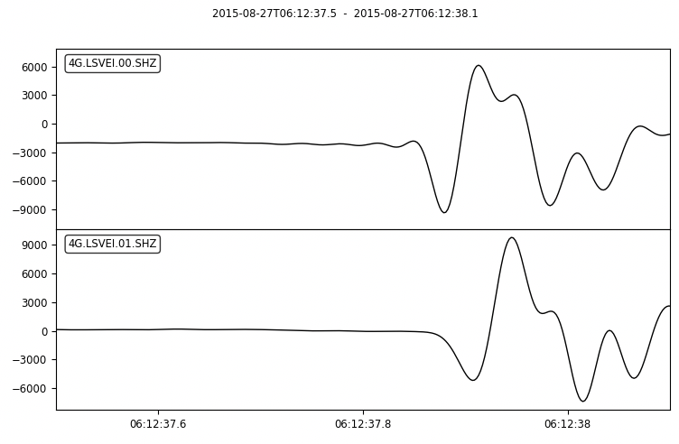

.. _tiskitpy.FIRConverter_example:

========================================
The tiskitpy FIRConverter class
========================================

Replacing a stream's last zero-phase FIR stage by an equivalent minimum
phase stage, to improve first arrival time and direction picks.

The ``fir_converter_sds``` console script allows you to apply this to an
entire SDS directory.

.. code-block:: python

    from tiskitpy import FIRConverter
    from obspy.core import read, UTCDateTime

    # Create a converter from a zero-phase FIR file
    converter = FIRConverter.from_zeros_file('data/cs5322_fir3.json', 0)

    # Plot technical figures about the input FIR
    print('Plotting Z-plane representation of the input filter')
    converter.plot_zplane()

.. code-block:: none

    Plotting Z-plane representation of the input filter



.. code-block:: python

    print('Plotting decomposition of the input filter')
    converter.plot_impulse_parts()

.. code-block:: none

    Plotting decomposition of the input filter


   
.. code-block:: python

    # Apply the converter to the data
    datafile = 'data/LSVEI_20150827T0612.mseed'
    plotstart = UTCDateTime('2015-08-27T06:12:37.5')
    plot_seconds = 0.6

    # Read and convert data
    st = read(datafile, 'MSEED')
    st_min, _ = converter.apply(st, new_loc_code='01')

    # Plot
    print(f'Plotting Lucky Strike event at {str(plotstart)}.  Locations are:\n'
          '    "00": the original data\n'
          '    "01": converted to minimum phase')
    st_compare = st.select(component='Z') + st_min.select(component='Z')
    st_compare.resample(500)  # Oversample, to smooth the waveform
    st_compare.plot(starttime=plotstart,
                    endtime=plotstart + plot_seconds)

.. code-block:: none

    Plotting Lucky Strike event at 2015-08-27T06:12:37.500000.  Locations are:
        "00": the original data
        "01": converted to minimum phase



## The zero-phase filter file

There are several ways to decribe the zero-phase filter or its conversion.
In this example we use a JSON file describing the zero-phase filter and
the constructor ``FIRConverter.from_zeros_file``:

The JSON file must contain:

- ``type``: ``linear``.
- ``fir``: the linear-phase coefficients.
- ``timetag``: the sample offset to ``fir``'s peak.
- ``decimation_factor``: the decimation applied after this filter.

The contents of ``data/cs5322_fir3.json`` are:

.. code-block:: json

    {
        "type": "linear",
        "fir": [
            -26,    -247,     -822,   -1362,   -839,   1012,    2197,      212,   -3443,   -3077,
           3156,    7168,     -256,  -10709,  -7644,  10713,   18055,    -3873,  -28007,  -11826,
          31641,   35194,   -22177,  -60427,  -5404,  77065,   51056,   -71982, -106905,   33416,
         156296,   43678,  -175718, -152408, 139856, 270573,  -29083,  -360427, -162173,  371807,
         417807, -246840,  -693181,  -78388, 902497, 685231, -865217, -1713558,    -262, 3276208,
        4950471,
        3276208,    -262, -1713558, -865217, 685231, 902497,  -78388,  -693181, -246840,  417807,
         371807, -162173,  -360427,  -29083, 270573, 139856, -152409,  -175718,   43678,  156296,
          33416, -106905,   -71982,   51056,  77065,  -5404,  -60427,   -22177,   35194,   31641,
         -11826,  -28007,    -3873,   18055,  10713,  -7644,  -10709,     -256,    7168,    3156,
          -3077,   -3443,      212,    2197,   1012,   -839,   -1362,     -822,    -247,     -26
        ],
        "timetag": 50,
        "decimation_factor": 2
    }
 