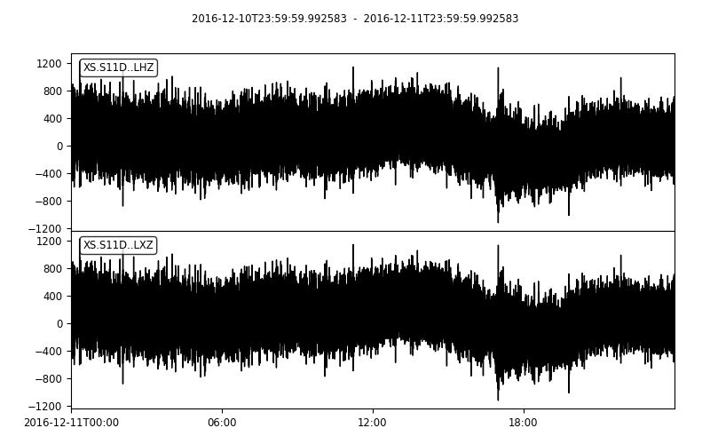
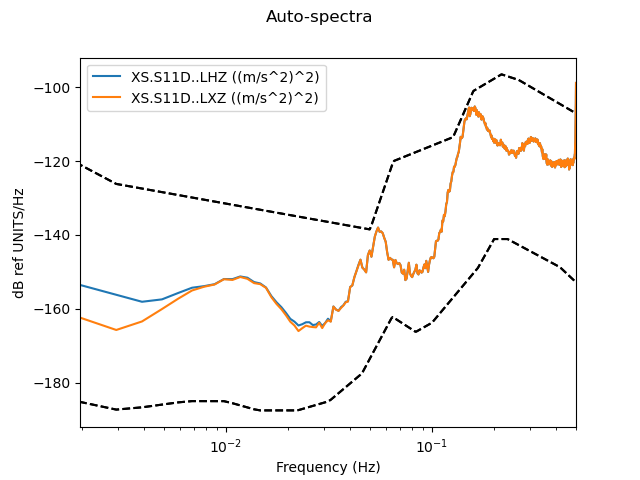

==============================
CleanRotator example code
==============================

.. code-block:: python

    stream = read('data/XS.S11D.LH.2016.12.11.mseed', 'MSEED')
    inv = read_inventory('data/XS.S11_decimated.station.xml', 'STATIONXML')
    cr = CleanRotator(stream)

::
    Optimization terminated successfully.
             Current function value: 510824.252893
             Iterations: 97
             Function evaluations: 185
    INFO:root:    variance reduced from 2.07e+06 to 5.11e+05 (75.4% lower)
    INFO:root:Best angle, azimuth is (-0.09, 32.28)

.. code-block:: python

    stream_rotated = cr.apply(stream)

    # Change channel names so as not to conflict with existing
    for tr in stream_rotated:
        tr.stats.channel = tr.stats.channel[0] + 'X' + tr.stats.channel[2]
    inv_x = inv.copy()
    for ch in inv_x[0][0]:
        ch.code = ch.code[0] + 'X' + ch.code[2]
        inv[0][0].channels.append(ch)
    
    z_compare = stream.select(channel='*Z') + stream_rotated.select(channel='*Z')
    print(z_compare)

.. code-block:: python

    z_compare.plot()

.. code-block:: python

    sd_compare = SpectralDensity.from_stream(z_compare, inv=inv)
    sd_compare.plot(overlay=True)

::

    2 Trace(s) in Stream:
    XS.S11D..LHZ | 2016-12-10T23:59:59.992583Z - 2016-12-11T23:59:59.992583Z | 1.0 Hz, 86401 samples
    XS.S11D..LXZ | 2016-12-10T23:59:59.992583Z - 2016-12-11T23:59:59.992583Z | 1.0 Hz, 86401 samples

.. code-block:: python

    z_compare.plot()

   
.. code-block:: python

    sd_compare = SpectralDensity.from_stream(z_compare, inv=inv)
    sd_compare.plot(overlay=True)

   
   
