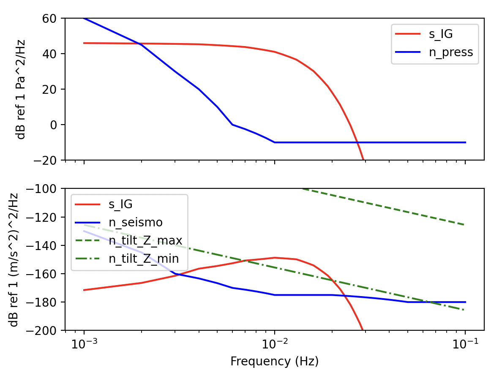
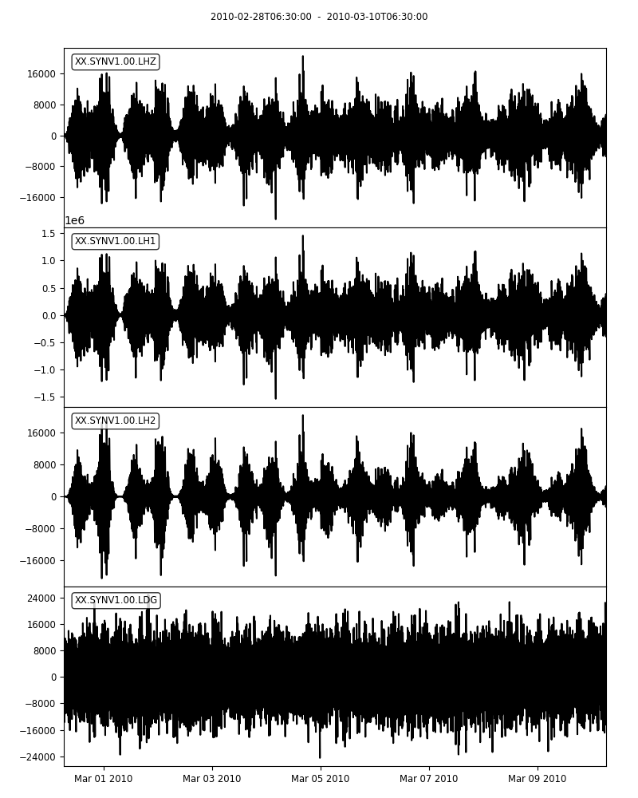
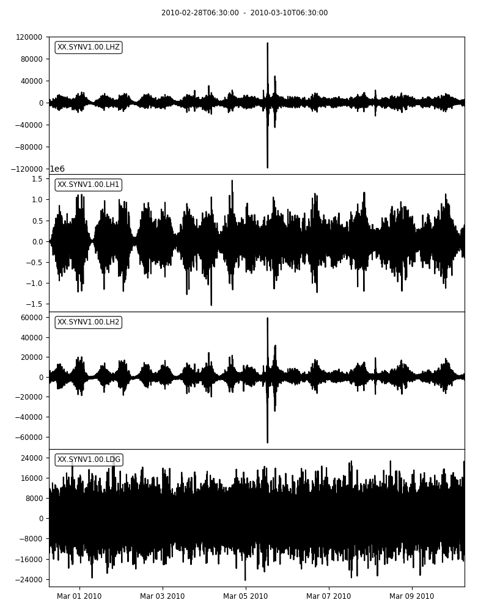
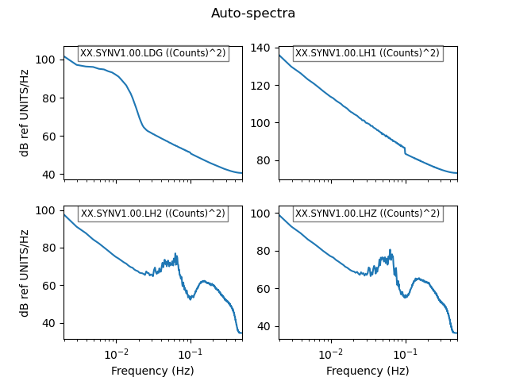
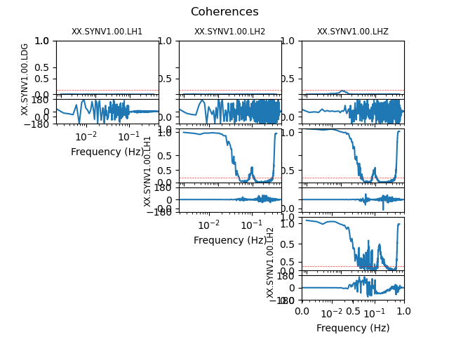

.. _tiskitpy.SpectralDensity_example:

==============================
ComplianceNoise example code
==============================

.. code-block:: python

    """
    Create synthetic OBS training data

    - Read in real data from a quiet continental site
    - Create a noise model using the ComplianceNoise class with default values
    - Add the two together
    - Save the result
    - Also save:
        - The original input data
        - The calculated compliance
    
    """
    from pathlib import Path

    from obspy import read, read_inventory, UTCDateTime

    from tiskitpy import SpectralDensity, ComplianceNoise

    data_file = 'G.TAM_2010059-2010069.mseed'  # post-Maule eq
    inv_file = 'G.TAM.2010.station.xml'
    wdepth = 2400
    station = 'SYNV1'
    plot_dir = 'plots_synth_training'

    # Read the real data and its metadata
    real_data = read(data_file, 'MSEED')
    resp_trace = real_data[0].copy()
    # Change the start time to "hide" where it is from
    resp_trace.stats.start_time = UTCDateTime(2024,1,1)
    inv = read_inventory(inv_file, 'STATIONXML')

.. code-block:: python

     # Create the noise model and synthetic data stream
    noise_model = ComplianceNoise(wdepth, Z_offset_angles=(3,15))
    noise_model.plot(outfile='noise_model.png')
    noise_model.save_compliance(max_freq=0.07)
    data, sources = noise_model.streams(real_data[0], s_sensitivity=3774870000,
                                        station=station, forceInt32=True)

   
.. code-block:: python

    data.plot(equal_scale=False')

   
.. code-block:: python

    # Add the real and synthetic data together
    data.select(channel='LHZ')[0].data += real_data.select(channel='LHZ')[0].data
    data.select(channel='LH1')[0].data += real_data.select(channel='LHN')[0].data
    data.select(channel='LH2')[0].data += real_data.select(channel='LHE')[0].data
    data.plot(equal_scale=False)

   
.. code-block:: python

    # Plot synthetic+real PSD
    sd_data = SpectralDensity.from_stream(data)
    sd_data.plot()
    sd_data.plot_coherences()

