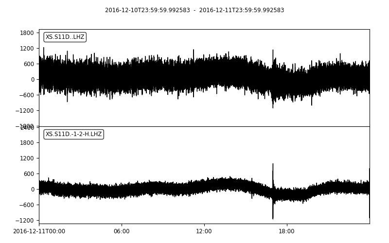
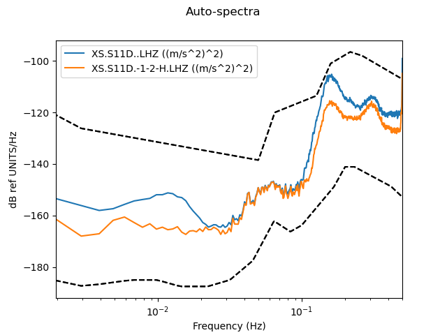

.. _tiskit.DataCleaner_example:

==============================
DataCleaner example code
==============================

.. code-block:: python

    from obspy.core.stream import read
    from obspy.core.inventory import read_inventory
    from tiskit import DataCleaner, SpectralDensity

    stream = read('data/XS.S11D.LH.2016.12.11.mseed', 'MSEED')
    inv = read_inventory('data/XS.S11_decimated.station.xml', 'STATIONXML')
    dc = DataCleaner(stream, ['*1','*2','*H'])
    stream_cleaned = dc.clean_stream(stream)
    z_compare = stream.select(channel='*Z') + stream_cleaned.select(channel='*Z')
    print(z_compare)

.. code-block::

    2 Trace(s) in Stream:
    XS.S11D..LHZ       | 2016-12-10T23:59:59.992583Z - 2016-12-11T23:59:59.992583Z | 1.0 Hz, 86401 samples
    XS.S11D.-1-2-H.LHZ | 2016-12-10T23:59:59.992583Z - 2016-12-11T23:59:59.992583Z | 1.0 Hz, 86401 samples

.. code-block:: python

    z_compare.plot()

   
.. code-block:: python

    sd_compare = SpectralDensity.from_stream(z_compare, inv=inv)
    sd_compare.plot(overlay=True)

   
   
