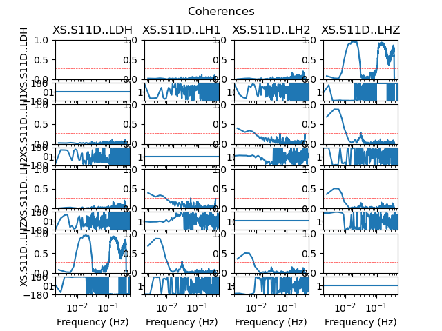
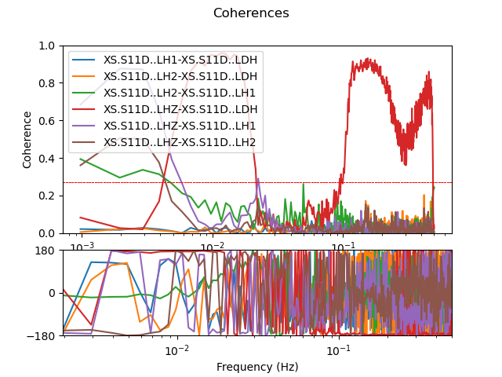

.. _tiskitpy.SpectralDensity_example:

==============================
SpectralDensity example code
==============================

.. code-block:: python

    from obspy.core.stream import read
    from obspy.core.inventory import read_inventory
    from tiskitpy import SpectralDensity

    stream = read('data/XS.S11D.LH.2016.12.11.mseed', 'MSEED')
    inv = read_inventory('data/XS.S11_decimated.station.xml', 'STATIONXML')
    sd = SpectralDensity.from_stream(stream, inv=inv)
    print(sd)

.. code-block:: none

  SpectralDensity object:
	  channel_names=['XS.S11D..LDH', 'XS.S11D..LH1', 'XS.S11D..LH2', 'XS.S11D..LHZ']
	  channel_units=['Pa', 'm/s^2', 'm/s^2', 'm/s^2']
	  512 frequencies, from 0.000977 to 0.5Hz
	  n_windows=81
	  window_type=prol1pi

.. code-block:: python

    sd.plot()

.. image:: images/1_SpectralDensity_plot.png
   :width: 564
   
.. code-block:: python

    sd.plot(overlay=True)

.. image:: images/1_SpectralDensity_plot_overlay.png
   :width: 564
   
.. code-block:: python

    sd.plot_coherences()

   
.. code-block:: python

    sd.plot_coherences(overlay=True)

   
 
