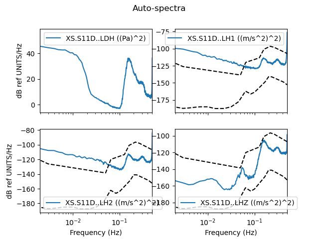
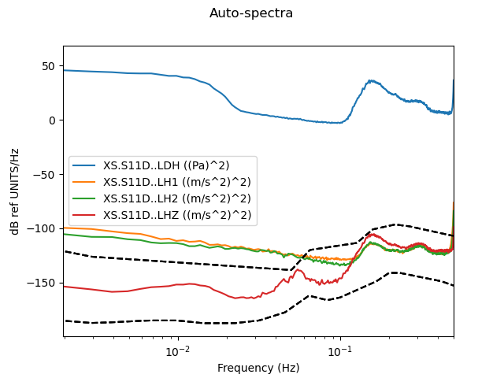

==============================
SpectralDensity Example code
==============================

.. code-block:: python

from obspy.core.stream import read
from obspy.core.inventory import read_inventory
from tiskit import SpectralDensity

stream = read('data/XS.S11D.LH.2016.12.11.mseed', 'MSEED')
inv = read_inventory('data/XS.S11_decimated.station.xml', 'STATIONXML')
sd = SpectralDensity.from_stream(stream, inv=inv)
sd.plot()
sd.plot(overlay=True)
print(sd)

`sd.plot()` outputs:

   
`sd.plot(overlay=True)` outputs:

   
   
`print(sd)` outputs:

.. code-block:: python

  SpectralDensity object:
	  channel_names=['XS.S11D..LDH', 'XS.S11D..LH1', 'XS.S11D..LH2', 'XS.S11D..LHZ']
	  channel_units=['Pa', 'm/s^2', 'm/s^2', 'm/s^2']
	  512 frequencies, from 0.000977 to 0.5Hz
	  n_windows=81
	  window_type=prol1pi
