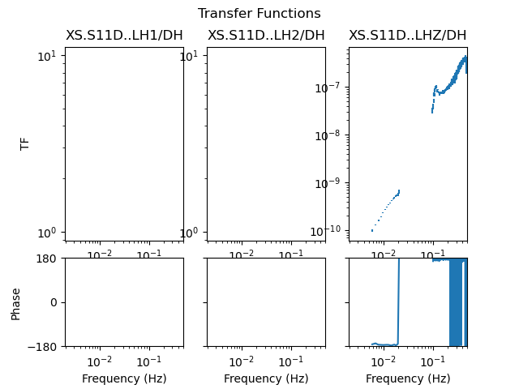

.. _tiskit.TransferFunctions_example:

==============================
TransferFunctions example code
==============================

.. code-block:: python

    from obspy.core.stream import read
    from obspy.core.inventory import read_inventory
    from tiskit import SpectralDensity, TransferFunctions

    stream = read('data/XS.S11D.LH.2016.12.11.mseed', 'MSEED')
    inv = read_inventory('data/XS.S11_decimated.station.xml', 'STATIONXML')
    sd = SpectralDensity.from_stream(stream, inv=inv)
    xfs = TransferFunctions(sd, '*H')
    print(xfs)

.. code-block:: none

    TransferFunctions object:
        input_channel='XS.S11D..LDH'
        output_channels=['XS.S11D..LH1', 'XS.S11D..LH2', 'XS.S11D..LHZ']
        noise_channels=['output', 'output', 'output']
        n_windows=81

.. code-block:: python

    xfs.plot()

   